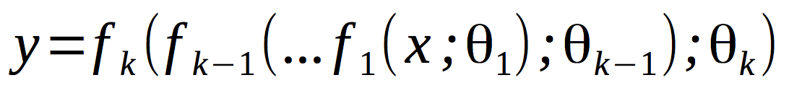
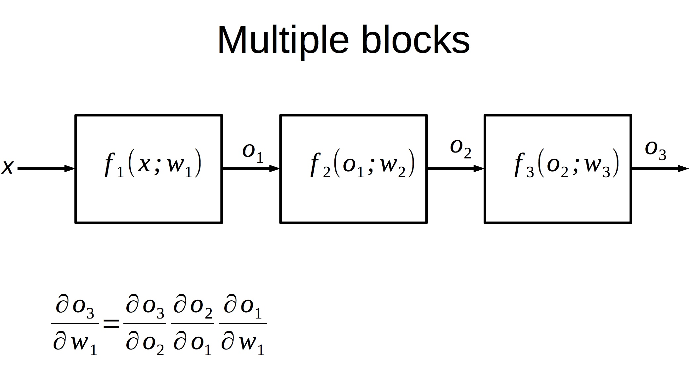

# Modular backpropagation

A neural network is nothing but a composition of several linear and non-linear functions:





Given a specific architecture, i.e. composition, one can easilywrite the gradient w.r.t. parameters.


But a modular approach is desirable so that we don't have to derive the gradient again and again. We can “compose” new architectures by simply connecting computing blocks as show below. 




Implementation of a modular back-propagation network.


* Fully connected layer (both forward and backward pass),
* Rectified linear unit layer (both forward and backward pass),
* Modular back-propagation.

#How to run
```sh
$ python run_softmax.py data/spiral.npz
$ python run_softmax.py data/moon.npz
$ python run_MLP.py data/spiral.npz
$ python run_MLP.py data/moon.npz
```
